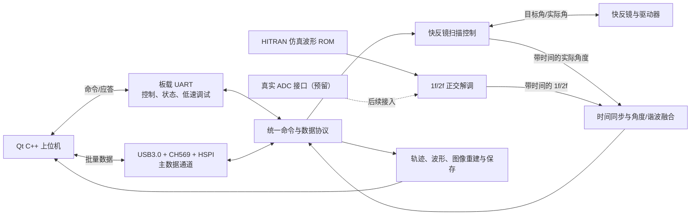

# 基于快反镜的甲烷扫描成像软件系统总体方案设计

> 文档版本：V1.0（总体方案）  
> 编写日期：2026-09-02  
> 项目目录：`E:/Documents/CH4_Imaging_Code_v2`  
> 当前阶段：无 ADC、无 DAC，使用 FPGA 内部甲烷吸收仿真数据完成第一版闭环  
> 目标硬件：ACX750-CH569，现有工程使用 Xilinx Artix-7 `xc7a200tfbg484-2`

## 1. 文档目的

本方案用于指导以下两部分的统一开发：

1. FPGA 下位机：快反镜扫描、角度反馈、仿真 ADC 数据、DILA 解调、时间同步、数据融合和通信；
2. Qt C++ 上位机：设备控制、参数设置、波形和轨迹显示、甲烷图像重建、数据保存和运行诊断。

第一版优先实现“能够稳定运行和完整演示”的系统，不在早期反复优化细节。待第一版闭环跑通后，再接入真实 ADC、DAC，并继续提高速度和成像质量。

## 2. 需求结论

### 2.1 第一版必须实现

- 控制快反镜进行 Z 字形逐行扫描，并支持静态偏转、停止、回零和回扫描起点；
- 接收快反镜实际 X/Y 角度反馈；
- 从 FPGA 内部 ROM 循环读取基于 HITRAN 生成的甲烷吸收仿真波形；
- 对仿真波形进行 1f、2f 正交解调，输出 I/Q、幅值和归一化结果；
- 使用 FPGA 内的同一个时间基准，把解调结果与实际角度配对；
- 上位机显示实际扫描轨迹、1f、2f、2f/1f 和二维甲烷图像；
- 上位机能够设置参数、启停、保存数据、显示通信和错误日志；
- 支持无硬件演示模式，便于先完成上位机联调；
- 工程、脚本、生成文件和项目文档全部放在本项目目录内。

### 2.2 第一版暂不实现

- 真实 ADC 采样；
- 真实 DAC 和激光器 WMS 驱动；
- 用 2f 或 2f/1f 直接给出有计量意义的 ppm·m 浓度；
- 对所有扫描速度、滤波器组合和 USB3.0 极限速度做最终优化。

未接入真实 ADC、DAC、激光器和标定气室以前，上位机只能显示“相对甲烷信号”或“仿真浓度”，不能把结果标成已经标定的真实浓度。

## 3. 现有工程与资料评估

### 3.1 可以直接复用的内容

| 来源 | 可复用内容 | 处理方式 |
|---|---|---|
| 快反镜 FPGA 工程 `uart_bridge_v4` | 4.608 Mbps 快反镜通信、9 字节原生帧校验、Z 字扫描、反馈判稳、角度上报 | 提取为独立的 `fsm_ctrl` 模块组 |
| 快反镜 Qt 工程 `QTFSM_V1.0` | 扫描参数模型、Q13 角度换算、轨迹绘制、丢帧统计、静态偏转 | 提取业务逻辑，不直接复制整个窗口 |
| DILA FPGA 工程 `DILA_260823` | NCO、1f/2f 混频、CIC、FIR、ROM 仿真源、配置寄存器和 CRC | 整理成独立的 `dila_core` 模块组 |
| DILA Qt 工程 `QTDILA_V1.0` | 通信解析、Mock 设备、I/Q 波形、A1/A2 计算、配置应用和部署方法 | 作为新上位机的主要代码基础 |
| 板卡资料 | ACX750 引脚、CH9102 串口、CH569、32 位 HSPI、USB3.0 示例 | 用于新顶层、XDC 和 USB3.0 适配 |

### 3.2 已确认的硬件和接口事实

- 板载时钟为 50 MHz；
- 板载 USB 转 UART 的 FPGA 引脚为 `UART_RXD=L21`、`UART_TXD=M21`；
- 快反镜原生接口为 RS-422、4.608 Mbps、8N1；
- 快反镜原生帧为 9 字节，帧头 `55 AA`，角度为 16 位有符号数，满量程约为 ±4°；
- 现有快反镜代码用 Q13 表示角度，即 `角度 = int16 / 8192`，与 ±4°满量程相符；
- 原生协议文档中的 ±1.5°示例计算是错误的，不能继续使用；
- 快反镜现有工程把反馈频率限制为 100～2500 Hz。第一版继续使用这个已测试范围；
- ACX750 上的 USB3.0 不是 FPGA 直接连接电脑，而是 `FPGA ↔ 32 位 HSPI ↔ CH569 ↔ USB3.0 ↔ PC`；
- 板卡教程的测速界面显示：上传约 268.21 M/s、下传约 94.04 M/s，教程语境下可理解为 MB/s。该数值只作为板卡能力参考，实际单位和持续传输能力都要在本项目中重新测量，不能直接当成新系统保证值；
- HSPI 单包有效负载为 1～4096 字节，并自带包序号和 CRC；
- 现有两个 FPGA 工程均已在 50 MHz 下完成实现并满足时序。DILA 当前报告约使用 23.60% LUT、16.87% 寄存器、26.76% DSP，快反镜工程约使用 8.05% LUT、8.47% 寄存器；按现有报告估算，合并后 Artix-7 200T 仍有资源余量，但最终仍须以新工程综合结果为准。

### 3.3 合并前必须处理的不一致

1. 快反镜系统协议和 DILA 系统协议的帧头、字节顺序、命令定义完全不同，不能简单接在一起；
2. DILA 文档、Qt 程序和当前 FPGA 顶层存在参数不一致：文档曾使用 25.6 MSPS、2 kHz 扫描和 128 点曲线，而当前 `wms_top.v` 使用 50 MHz 时钟、64 kSPS、5 Hz 扫描、1600 点和 256 个上传位置；
3. 当前 DILA 顶层为硬件诊断版本，多项配置被固定值覆盖，且没有严格受“开始采集”命令控制，不能直接作为正式顶层；
4. 当前 DILA Qt 界面为深色，而本项目要求白色界面；
5. 当前两个上位机各自管理一个设备，尚未共享扫描编号、统一时间、配置版本和实验记录；
6. 现有角度流只有序号，没有硬件时间戳，不能保证与谐波结果精确配对。

新项目将以实际源码为参考，重新建立统一顶层、统一协议和统一上位机；原工程只读，不在原目录内修改。

## 4. 总体架构



系统采用一个 FPGA 主时钟和一个统一的 64 位计时器。所有角度、解调结果、帧开始、行切换、参数版本都以这个计时器为准。电脑收到数据的时间只用于日志，不用于角度和谐波的配对。

## 5. FPGA 下位机设计

### 5.1 顶层划分

建议新建以下模块层次：

```text
ch4_imaging_top
├─ clock_reset
├─ system_timebase
├─ fsm_ctrl
│  ├─ fsm_scan_generator
│  ├─ fsm_command_tx
│  ├─ fsm_feedback_rx
│  └─ fsm_event_tracker
├─ sample_source
│  ├─ ch4_rom_source
│  └─ adc_interface_stub / adc_interface（后续）
├─ dila_core
│  ├─ coherent_nco
│  ├─ iq_mixer_1f_2f
│  ├─ cic_decimator
│  ├─ fir_filter
│  ├─ magnitude
│  └─ spectral_feature_extractor
├─ fusion_core
│  ├─ angle_history
│  ├─ delay_compensation
│  ├─ angle_interpolator
│  └─ fused_point_builder
├─ config_and_status
│  ├─ shadow_register_bank
│  ├─ command_engine
│  └─ error_counters
├─ uart_transport
└─ usb_hspi_transport
```

模块之间使用 `valid/ready` 数据接口，并明确数据宽度、单位和时钟域。快反镜、DILA、融合和通信不直接读取彼此内部寄存器，避免后续修改一个模块时影响整个工程。

### 5.2 第一版顶层引脚安排

| 功能 | FPGA 引脚 | 说明 |
|---|---|---|
| 50 MHz 时钟 | W19 | 延用板卡手册和现有工程 |
| 复位按键 | D21 | 低电平复位 |
| 板载 UART 接收/发送 | L21 / M21 | 第一版上位机控制和数据 |
| 快反镜接收差分对 | F19 / F20 | 避开 USB3.0 控制跳线占用的引脚 |
| 快反镜发送差分对 | F18 / E18 | 避开 USB3.0 控制跳线占用的引脚 |
| CH569 HSPI | HD0～HD31 和 8 根控制线 | 第二阶段按板卡手册完整加入 |

快反镜差分口需要继续核对外部 RS-422 收发电路、极性、终端电阻和 Bank 电压。板卡 FPGA 端的 LVDS 引脚不能在没有收发器确认的情况下直接等同于完整 RS-422 电气接口。

### 5.3 快反镜扫描控制

第一版保留现有工程已经验证过的行为：

- Z 字形逐行扫描；
- X/Y 最小值和最大值；
- X 扫描频率；
- 目标图像帧频、行数或 Y 步长三种等价设置方式；
- 100～2500 Hz 角度反馈；
- 频率优先、波形优先两种策略；
- 静态 X/Y 偏转；
- 停止后保持、回零、回扫描起点；
- 扫描开始、行切换、换向和扫描结束事件；
- 反馈校验错误、反馈超时和目标/实际角度偏差监测。

建议默认参数先使用现有硬件较稳定的范围：X 频率不高于 15 Hz、反馈频率 2500 Hz。20 Hz 可保留，但界面提示端点可能出现明显圆角。

### 5.4 仿真采样源

第一版继续使用离线生成的甲烷吸收波形：

- 波形生成依据记录 HITRAN 数据来源、谱线范围、温度、压力、光程、浓度、噪声和量化方式；
- 生成 `.mem` 和 `.coe` 文件供 FPGA ROM 使用；
- ROM 输出与将来的真实 ADC 使用完全相同的数据宽度和 `sample_valid` 接口；
- 数据源支持：甲烷 ROM、常量、斜坡、简单谐波、PRBS、真实 ADC（预留）；
- 切换数据源只允许在停止采集时进行，或在下一次光谱扫描边界生效。

### 5.5 DILA 解调链

信号处理流程为：

```text
仿真/ADC 样本
  → 偏置和增益校正
  → 同一 NCO 生成 1f/2f 正弦和余弦参考
  → 四路乘法得到 I1/Q1/I2/Q2
  → 同参数 CIC 抽取
  → 同参数 FIR 滤波
  → 输出 I1/Q1/I2/Q2
  → 计算 A1、A2
  → 每个低频扫描周期提取有效特征
```

幅值计算：

```text
A1 = sqrt(I1² + Q1²)
A2 = sqrt(I2² + Q2²)
R  = A2 / A1
```

FPGA 输出 A1、A2；第一版由上位机使用 64 位或浮点数计算 `R`，这样更容易调整 A1 噪声门限，并节省 FPGA 除法资源。

每个低频波长扫描周期不能只随意取一个 2f 点。特征提取模块应在可设置的有效窗口内输出：

- A1 峰值或参考位置 A1；
- A2 峰值及其位置；
- I1/Q1/I2/Q2 对应值；
- 基线和噪声估计；
- 结果有效标志；
- 本次测量对应的硬件时间。

调试模式仍可上传整条 1f/2f 曲线，但实时成像默认只上传每个低频扫描周期的一条融合结果。

### 5.6 参数的安全应用

配置采用“先写临时区，再整体生效”的方式：

1. 上位机写入一组新参数；
2. FPGA 检查单项范围和参数之间是否冲突；
3. 检查通过后等待下一次安全边界；
4. 一次性替换当前参数；
5. `config_revision` 加 1，并清除滤波器历史；
6. 滤波器稳定以前的数据标记为无效。

这样可以避免扫描过程中只改了一半参数，导致同一幅图中混入两套设置。

### 5.7 角度和谐波融合方案

这是本项目的核心，采用“共同硬件时钟 + 延迟补偿 + 插值”的方法。

#### 5.7.1 时间标记

- FPGA 内设置 64 位、50 MHz 自由运行计数器，每个计数为 20 ns；
- 收到一帧合法快反镜反馈时，记录 `angle_rx_time`；
- 产生 DILA 测量结果时，根据滤波器固定延迟反推 `measurement_time`；
- 每次开始扫描生成新的 `image_id`，每次 Y 步进生成新的 `line_id`；
- 每次配置生效生成新的 `config_revision`。

#### 5.7.2 延迟补偿

快反镜反馈反映的是镜体较早时刻的位置，串行发送和控制器内部处理都会带来延迟。因此设置可校准参数：

- `mirror_feedback_delay_ticks`：快反镜反馈固定延迟；
- `dila_pipeline_delay_ticks`：DILA 滤波和计算延迟；
- `optical_path_delay_ticks`：默认 0，远距离应用时再启用；
- `max_angle_gap_ticks`：允许插值的最大角度样本间隔。

校正后的角度时间为：

```text
angle_time = angle_rx_time - mirror_feedback_delay_ticks
```

#### 5.7.3 实际角度插值

FPGA 保存最近若干个实际角度样本。对每个 `measurement_time`：

1. 找到测量时间前后的两个角度样本；
2. X、Y 分别做一次直线插值；
3. 如果两个角度样本间隔过大、CRC 错误或没有前后样本，使用最近角度并标记“低可信”，严重时丢弃该点；
4. 端点、Y 步进和滤波器未稳定期间的数据默认标记为无效，不参与正式图像。

插值会等待下一个角度样本到达，因此会增加最多一个反馈周期的显示延迟。2500 Hz 反馈时约为 0.4 ms，这个代价可以接受。

#### 5.7.4 融合点格式

每条实时成像记录固定为 48 字节：

| 字段 | 类型 | 说明 |
|---|---|---|
| `measurement_time` | `uint64` | 50 MHz 硬件计数 |
| `image_id` | `uint32` | 本次图像编号 |
| `line_id` | `uint16` | 行编号 |
| `point_id` | `uint16` | 行内点编号 |
| `x_angle`、`y_angle` | `int16 × 2` | 插值得到的实际角度，Q13 |
| `i1`、`q1`、`i2`、`q2` | `int32 × 4` | 解调结果 |
| `a1`、`a2` | `uint32 × 2` | 1f、2f 幅值 |
| `flags` | `uint16` | 方向、端点、滤波稳定、角度有效、溢出等 |
| `config_revision` | `uint16` | 参数版本 |

原始角度流、完整光谱曲线和原始 ADC 数据作为独立调试数据流，不与实时融合点混在一起。

### 5.8 错误处理和保护

FPGA 至少记录以下错误和计数：

- 快反镜反馈 CRC/校验错误；
- 快反镜反馈超时；
- 实际角度偏差过大；
- ADC 饱和和 DILA 计算溢出；
- 数据 FIFO 满、丢点、USB/UART 来不及发送；
- 非法参数、错误状态下的命令；
- CH569/HSPI 链路掉线；
- 配置版本不一致。

停止、通信看门狗超时或严重错误时，第一版默认停止扫描并保持当前位置；是否自动回零由用户设置。将来真实 DAC 接入后，还必须关闭激光调制输出并进入安全偏置。

## 6. 通信方案

### 6.1 UART 与 USB3.0 分工

| 通道 | 主要用途 | 第一版 |
|---|---|---|
| 板载 UART-USB | 连接、识别、参数读写、启停、状态、日志、低速融合数据 | 必须实现 |
| USB3.0 | 融合点、完整 1f/2f 曲线、原始数据、高速连续记录 | 第二阶段实现 |
| 快反镜 RS-422 | FPGA 与快反镜内部通信 | 必须实现，对上位机隐藏 |

UART 的 8N1 有效字节速度大约为波特率的十分之一：

| 链路 | 约可用速度 | 结论 |
|---|---:|---|
| 460800 baud | 46 kB/s | 适合命令和低速状态，不适合完整数据流 |
| 921600 baud | 92 kB/s | 可跑第一版低速融合点，余量较小 |
| USB3.0 板卡教程上传实测 | 约 268 MB/s | 适合正式数据流和调试原始数据 |

若每条融合点为 48 字节、结果速度为 2 kHz，仅记录本身就约为 96 kB/s，还没有计算协议开销和角度流，因此 921600 UART 不够。若输出完整的 1600 点光谱曲线，数据量会更大。

结论：正式系统应使用 USB3.0 传主数据。为了尽快完成第一版，可以先降低结果速度或只上传融合点，用 UART 跑通完整闭环；随后保持应用协议不变，增加 USB3.0 传输。

### 6.2 统一应用协议

快反镜的 `55 AA` 原生协议只存在于 FPGA 与快反镜之间。上位机与 FPGA 使用一套新的统一协议，UART 和 USB3.0 传输相同的应用帧。

建议帧格式：

```text
A5 5A | version | dst | src | type | flags |
sequence:u16 | payload_length:u16 | payload | crc16:u16
```

- 多字节字段统一使用小端；
- CRC 使用 CRC-16/CCITT-FALSE，覆盖 `version` 到最后一个 payload 字节；
- `sequence` 用于请求与响应配对，也用于连续数据丢包检查；
- 每条命令必须有成功或失败响应；
- 数据流带独立序号，不能阻塞命令响应；
- UART 单帧载荷上限建议 1024 字节；USB 应用帧连同帧头和 CRC 必须放入 HSPI 的 4096 字节有效区，因此应用载荷上限暂定 4080 字节，并由设备能力查询返回最终值；
- 更长的数据分片发送，每片包含总长度、片号和总片数；
- HELLO 响应必须包含协议版本、固件版本、FPGA 型号、时钟频率、能力标志和构建编号。

默认只允许 UART 发送控制命令，USB 主要上传批量数据，避免两个通道同时修改参数。如果以后允许 USB 控制，设备必须设置唯一的“控制通道所有者”，另一个通道只能查询状态。

命令按功能分组：

| 范围 | 用途 |
|---|---|
| `0x01～0x0F` | 设备识别、心跳、时间和能力查询 |
| `0x10～0x1F` | 寄存器读写、参数块读写 |
| `0x20～0x2F` | 参数检查、整体应用、恢复默认值 |
| `0x30～0x3F` | 扫描/采集启停、静态偏转和回零 |
| `0x40～0x4F` | 状态、错误和统计 |
| `0x50～0x5F` | 数据流选择、开始、停止和速率限制 |
| `0x60～0x6F` | 图像开始、行事件、融合点和图像结束 |
| `0x70～0x7F` | 原始角度、完整谐波曲线和原始采样调试数据 |

USB3.0 的 HSPI 自带一层包头、序号和 CRC。该层只负责 FPGA 与 CH569 之间可靠搬运数据，内部有效负载仍使用上述统一应用协议，避免 UART 和 USB 分别维护两套业务协议。

### 6.3 传输优先级

从高到低的优先级为：

1. 停止、回零和安全相关命令；
2. 命令响应和错误事件；
3. 实时融合点；
4. 原始角度流；
5. 完整谐波曲线；
6. 原始 ADC 数据。

当带宽不足时，先停止或降低调试数据，不允许阻塞快反镜控制和 DILA 处理。每类数据都有独立丢弃计数，上位机明确显示丢了哪类数据。

## 7. Qt C++ 上位机设计

### 7.1 技术方案

- Qt 6.11.2 + MinGW 64-bit；
- C++20、CMake 和 Ninja；
- UI、设备控制、协议解析、数据处理、保存分别放在独立类中；
- 串口、USB 接收和文件保存放到工作线程，界面线程只更新状态和绘图；
- 图形显示限制刷新频率，例如 20～30 帧/秒，不能每收到一个点就完整重画；
- 提供 Mock 下位机，在没有 FPGA 时生成轨迹、1f/2f 和融合图像；
- 所有界面文字和错误信息尽量使用直接、清楚的中文。

### 7.2 软件模块

```text
app
├─ ui                  白色界面、导航、状态提示
├─ device
│  ├─ DeviceSession    连接状态和命令事务
│  ├─ SerialTransport  UART
│  ├─ UsbTransport     CH569/USB3.0
│  └─ MockTransport    无硬件演示
├─ protocol            统一帧编解码、CRC、分片和版本检查
├─ control
│  ├─ MirrorService
│  ├─ DilaService
│  ├─ WmsService
│  └─ AcquisitionController
├─ processing
│  ├─ HarmonicProcessor
│  ├─ CoordinateCalibration
│  └─ ImageReconstructor
├─ visualization
│  ├─ TrajectoryPlot
│  ├─ HarmonicPlot
│  └─ MethaneImageView
└─ storage
   ├─ SessionRecorder
   └─ CsvExporter
```

### 7.3 页面设计

整体采用白色背景、浅灰分区和少量状态色。建议页面如下：

1. **总览**：连接状态、当前角度、扫描进度、A1/A2、2f/1f、当前图像和主要错误；
2. **连接与设备**：Mock/UART/USB 选择、串口、波特率、设备信息和固件版本；
3. **快反镜**：扫描范围、频率、行数、反馈频率、策略、静态偏转、轨迹和回零；
4. **采集与 DILA**：采样源、采样率、NCO、CIC、FIR、相位、门限和 1f/2f 波形；
5. **WMS 与仿真**：仿真浓度/压力/温度/光程信息，预留 DAC 和激光参数；
6. **甲烷图像**：实时二维图、色标、图像网格、有效点比例、暂停、清屏和导出；
7. **数据与诊断**：记录控制、文件路径、原始帧、错误计数、丢点统计和运行日志。

### 7.4 图像重建方法

上位机不按数据到达顺序直接画规则方格，而是使用融合记录中的实际 X/Y 角度：

1. 将实际角度通过标定参数转换为场景坐标；
2. 根据图像宽度和高度把坐标放入对应网格；
3. 每个网格可保存最近值、平均值、最大值和有效样本数；
4. Z 字扫描反向行由实际坐标自然落入正确位置，不需要把奇数行手工翻转；
5. 缺点保持透明或显示为无数据，不用相邻大数值强行填满；
6. 实时显示默认使用 `A2/A1`，并可切换 A2、I2、Q2 和质量标志；
7. 平滑、插值和颜色范围只影响显示，原始数据不被覆盖；
8. 一幅图完成后保存原始融合点、图像矩阵、配置快照和错误统计。

### 7.5 数据保存

每次采集建立一个独立会话目录，例如：

```text
Data/session_20260902_213000/
├─ session.json          设备、固件、参数、标定和时间信息
├─ fused_points.bin      原始融合点，主记录
├─ image.csv             重建图像矩阵
├─ harmonic_curve.csv    可选的 1f/2f 曲线
├─ events.csv            开始、停止、行切换和错误
└─ run.log               运行日志
```

二进制文件用于无损、快速记录；CSV 用于查看和算法分析。程序崩溃或意外断线后，已经落盘的数据仍应可以读取。

### 7.6 VS Code、一键运行和发布

Qt 工程将提供：

- `CMakeLists.txt`、`CMakePresets.json`；
- `.vscode/settings.json`、`tasks.json`、`launch.json` 和 `c_cpp_properties.json`；
- `compile_commands.json`，供 VS Code 正确找到 Qt 头文件；
- 项目内的构建和运行脚本，供 Code Runner 调用；
- Debug 一键编译运行、Release 一键打包；
- `windeployqt` 自动复制 Qt 和 MinGW 运行库；
- 发布目录中的 EXE 可在未配置 Qt 环境变量的电脑上直接运行。

工程明确使用 `C:/Qt/6.11.2/mingw_64` 和配套 MinGW，避免误用 Anaconda 自带的 Qt 5，从源头减少头文件红色波浪线和 DLL 缺失问题。

## 8. 建议参数清单

参数分为“常用”和“高级”。常用参数直接显示，高级参数折叠，避免主页面过于复杂。

### 8.1 快反镜参数

| 常用参数 | 高级参数 |
|---|---|
| X/Y 最小角和最大角 | 角度零点、比例和交叉轴标定 |
| X 扫描频率 | 端点位置误差门限 |
| 图像帧频、行数或 Y 步长 | 端点速度门限和连续稳定样本数 |
| 反馈频率 | 端点等待上限和 Y 后保持时间 |
| 频率优先/波形优先 | 反馈固定延迟补偿 |
| 静态 X/Y 角度 | 反馈超时和最大允许跟踪误差 |
| 停止动作 | 有效水平区域和端点丢弃区域 |

### 8.2 ADC/仿真采样参数

| 常用参数 | 高级参数 |
|---|---|
| 数据源选择 | 数据格式和通道掩码 |
| 采样率 | 偏置、增益、饱和上下限 |
| 仿真数据集 | 触发源、触发沿和触发延迟 |
| 仿真噪声 | 原始采样长度和预触发长度 |
| 开始/停止 | 丢样计数和校准版本 |

在没有真实 ADC 的第一版中，采样率必须与 ROM 数据生成时记录的采样率一致，不能只在界面改一个数字而不重新生成数据或调整读出时钟。

### 8.3 DILA 参数

| 常用参数 | 高级参数 |
|---|---|
| 参考调制频率 | 32 位 NCO 相位增量 |
| 低频波长扫描频率 | 1f/2f 相位补偿 |
| CIC 抽取倍数 | CIC 级数（通常需重新综合） |
| FIR 抽取倍数 | FIR 系数、系数库和校验值 |
| FIR 抽头数 | 通带、阻带和输出速率 |
| 每次扫描点数 | DILA 固定延迟补偿 |
| A1 有效门限 | 2f 搜索窗口和基线窗口 |
| 输出内容选择 | 滤波稳定等待长度 |

滤波器阶数并非都适合运行时任意修改。FIR 抽头数可在预留上限内设置；CIC 级数会明显改变硬件结构，建议第一版固定为 3 级，只让用户调整抽取倍数。

### 8.4 WMS/DAC 预留参数

| 常用参数 | 高级/安全参数 |
|---|---|
| 激光偏置 | DAC 位宽、参考电压和实测增益/偏置 |
| 锯齿波频率和幅值 | 输出上限和下限 |
| 正弦波频率和调制深度 | 软启动时间和斜率限制 |
| 相位和输出使能 | 看门狗超时后的安全输出值 |
| 扫描方向 | 外部使能、急停和联锁输入 |

在 DAC 型号、输出极性、参考电压和外部放大倍数确定前，不承诺“电压值与 DAC 码”的最终换算关系。

### 8.5 图像与融合参数

- 图像宽度、高度和坐标范围；
- 显示量：A2、A2/A1、I2、Q2；
- A1 噪声门限；
- 角度最大插值间隔；
- 端点和换行数据是否参与成像；
- 单元格采用最近值、平均值或最大值；
- 色标范围、自动范围和调色板；
- 坐标标定矩阵或多项式版本；
- 浓度标定系数和版本；
- 显示刷新率、记录内容和调试数据降采样比例。

## 9. 工程目录规划

建议按以下结构建立项目：

```text
CH4_Imaging_Code_v2/
├─ Docs/
│  ├─ 需求.md
│  ├─ 总体方案设计.md
│  ├─ 通信协议.md
│  ├─ FPGA详细设计.md
│  ├─ QT详细设计.md
│  └─ 测试与验收方案.md
├─ FPGA/
│  ├─ rtl/
│  │  ├─ top/ clock/ fsm/ adc/ dila/ fusion/ protocol/ transport/ memory/
│  ├─ sim/
│  ├─ constraints/
│  ├─ ip/
│  ├─ scripts/
│  ├─ data/
│  └─ vivado/             Vivado 工程生成目录
├─ QT/
│  ├─ src/
│  ├─ tests/
│  ├─ resources/
│  ├─ tools/
│  ├─ .vscode/
│  ├─ build/              构建目录
│  └─ dist/               可直接运行的发布目录
├─ Shared/
│  ├─ protocol.yaml
│  ├─ register_map.yaml
│  └─ test_vectors/
├─ Tools/
│  ├─ spectroscopy/
│  ├─ protocol_generator/
│  └─ data_analysis/
├─ Data/                  运行数据，默认不提交版本库
└─ README.md
```

共享协议和寄存器表只维护一份，再由脚本生成 Verilog 常量、C++ 头文件和协议测试向量，避免上、下位机命令号不一致。

## 10. 开发阶段和交付物

### 阶段 0：工程骨架和协议冻结

- 创建规范目录、Git 忽略规则和构建脚本；
- 把可复用代码复制到新项目并保留来源说明；
- 完成统一协议、寄存器表和固定测试帧；
- 建立 FPGA 和 Qt 的自动构建入口。

交付：新工程可编译，协议单元测试通过。

### 阶段 1：UART 第一版闭环

- 合并快反镜控制、ROM 和 DILA；
- 加入统一时间计数、角度历史和融合点；
- 先用 UART 输出降低速率的融合数据；
- Qt 完成连接、参数、轨迹、1f/2f、2f/1f 和图像页面；
- Mock 模式可完整演示。

交付：无 ADC/DAC 条件下，可从开始扫描一直运行到得到一幅仿真甲烷图像。

### 阶段 2：USB3.0 主数据通道

- 从 200T USB3.0 示例中移植 HSPI 收发；
- 整理 CH569 固件，定义 USB 端点和缓冲策略；
- Qt 接入 CH372/CH375 驱动或厂家提供的用户态接口；
- 完成 UART 控制与 USB 数据并行运行；
- 测试持续速度、丢包、拔插和异常恢复。

交付：融合数据和调试波形通过 USB3.0 稳定传输。

### 阶段 3：真实 ADC/DAC 接入

- 根据最终 ADC/DAC 型号完成引脚、电平、时钟和时序设计；
- 接入真实探测器数据和 WMS 调制输出；
- 增加激光器安全限制、软启动和看门狗；
- 完成 ADC/DAC 电压标定。

交付：真实光路下获得稳定 1f、2f 和 2f/1f。

### 阶段 4：浓度和成像标定

- 标定快反镜角度到场景坐标；
- 测量快反镜反馈和 DILA 的固定延迟；
- 使用已知浓度、压力、温度和光程建立浓度换算；
- 进行重复性、稳定性、空间分辨率和长时间运行测试。

交付：可说明误差范围的甲烷浓度图像。

## 11. 验证与验收

### 11.1 FPGA 单元验证

- 快反镜原生帧：正确帧、错头、错尾、错校验、分段输入；
- 扫描：起点、终点、换向、Y 步进、停止和回零；
- DILA：与软件参考模型对比 I/Q、幅值、相位和滤波延迟；
- 融合：已知角度曲线下检查时间插值和异常标志；
- 协议：半帧、粘包、CRC 错、长度错、序号回绕和未知命令；
- 缓冲：持续满速、优先级和丢弃计数。

### 11.2 Qt 自动测试

- CRC 和帧编解码；
- 分片、粘包、垃圾字节和错误恢复；
- 请求超时、重试、重复响应和设备断线；
- Mock 完整扫描；
- 图像落点、反向行和缺失点；
- 配置保存、读取和版本检查；
- 白色界面离屏启动测试；
- Release 打包后的 EXE 启动测试。

### 11.3 第一版验收标准

1. FPGA 与 Qt 工程均可由项目内脚本一键构建；
2. VS Code 不出现 Qt 头文件路径错误，Code Runner 能启动程序；
3. Mock 模式和真实串口模式都能连接；
4. 快反镜可完成一幅 Z 字扫描，轨迹显示和丢帧统计正确；
5. FPGA ROM 数据经过真实 DILA 链输出，不由上位机伪造 1f/2f；
6. 每个成像点同时带实际 X/Y、谐波值、时间、图像编号、行号和参数版本；
7. 上位机可显示并保存轨迹、谐波曲线、2f/1f 和二维图像；
8. 人工制造错误帧或断线后，程序有明确提示，不崩溃；
9. 连续运行至少 1 小时，无界面卡死、内存持续增长和未统计的数据丢失；
10. 所有输出文件均位于本项目目录内。

## 12. 主要风险和当前待确认项

### 12.1 必须优先解决

1. **统一 DILA 参数基线**：64 kSPS/5 Hz 与 25.6 MSPS/2 kHz 两套设置差异很大。第一版应先固定一套能在 50 MHz FPGA 时钟下稳定运行、并与 ROM 数据一致的参数，再开放界面修改；
2. **USB3.0 不只是 FPGA 工作**：还需要 CH569 固件、Windows 驱动和 Qt 访问接口。移植前要核对厂家示例代码和接口使用许可；
3. **时间标记不能完全消除固定延迟**：快反镜反馈延迟和 DILA 滤波延迟仍需实测标定；
4. **当前没有真实浓度标定条件**：第一版只能证明数据链、解调和成像过程正确；
5. **确认实际 FPGA 型号**：方案按现有工程的 200T 编写。如果实际核心板是 35T 或 100T，资源、USB 示例和工程约束都要重新检查。

### 12.2 后续优化项

- 减少 DILA 的 DSP 使用量；
- 根据实际镜体响应调整扫描轨迹和端点有效区；
- 提高 USB 批量传输效率；
- 增加自动相位调整、自动基线和质量评分；
- 支持图像标定、浓度标定和多次扫描平均；
- 增加固件在线升级和版本兼容检查。

## 13. 总体结论

推荐采用“统一 FPGA 时间基准、FPGA 内完成基础融合、Qt 根据实际角度重建图像、UART 管控制、USB3.0 管主数据”的总体方案。

第一版先使用现有快反镜模块、HITRAN ROM 和 DILA 解调，通过 UART 输出降低速率的融合点，尽快完成从扫描到图像的完整闭环。USB3.0 在闭环验证后接入，但协议和软件结构从一开始就为它保留，避免后续推倒重做。

该方案既能利用两个现有工程已经验证过的内容，又解决了它们目前最关键的缺口：协议不统一、参数不一致以及角度和谐波没有可靠时间对应关系。

## 14. 本方案的核对依据

本次重点核对了以下需求、协议、源码和硬件资料：

- 本项目 `Docs/需求.md` 和快反镜原生通信协议；
- `uart_bridge_v4` 的顶层、扫描发生器、命令解析、快反镜反馈解析、角度封装、XDC、仿真及实现报告；
- `QTFSM_V1.0` 的协议、串口、控制器、扫描参数模型、轨迹显示、测试和技术说明；
- `DILA_260823` 的架构、协议和寄存器表、固定点说明、HITRAN 仿真说明、顶层、NCO、混频、CIC、FIR、ROM、遥测、仿真及实现报告；
- `QTDILA_V1.0` 的协议、设备会话、原生 Windows 串口、波形显示、Mock、界面、测试、构建和部署说明；
- ACX750-CH569 用户手册 V1.1、USB3.0 教程 V1.2、引脚资料，以及 200T USB3.0 回环、测速和采集示例的目录与说明。

板卡资料中与本项目无关的显示屏、摄像头、音频等内容未纳入方案。后续真正移植 USB3.0 时，还需针对 200T 示例压缩包、CH569 固件工程和 PC 接口库做一次专项代码审查。
